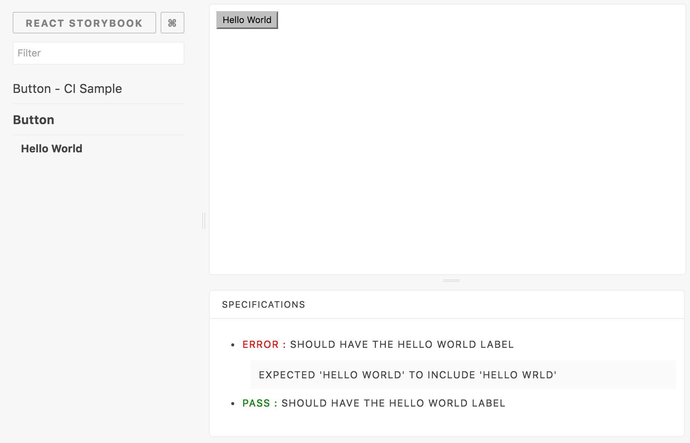
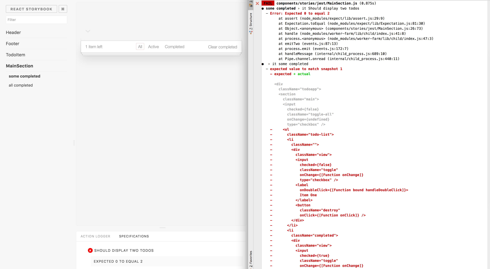

# Specifications Addon [](https://www.npmjs.com/package/storybook-addon-specifications)

> **Needs at least [react-storybook](https://github.com/kadirahq/react-storybook) 2.2.1**

This addon for storybook will allow you to write tests based on your stories and display results directly inside storybook.

⚠️ I don't have time to maintain this project anymore. If someone is interested to take over the maintainance and further development, please contact me. 

> **If you want to learn more about the ideas behind this addon, you can read this article : [Building a react components living documentation using react-storybook.](https://medium.com/@mlthuret/building-a-react-components-living-documentation-using-react-storybook-5f11f0e7d23e#.5g58g5i3t).**



## Table of contents

* [Getting Started](#getting-started)
* [Using enzyme](#using-enzyme)
* [Use your stories with a test runner](#use-your-stories-with-a-test-runner)
  * [Using Jest](#using-jest)
    * [Hooks and specifics jest features](#hooks-and-specifics-jest-features)
    * [Snapshot all your stories automatically](#snapshot-all-your-stories-automatically)
  * [Using Mocha](#using-mocha)
    * [Hooks and specifics mocha features](#hooks-and-specifics-mocha-features)
* [Loading External Test Files](#loading-external-test-files)

## Getting Started

First, install the addon

```shell
npm install -D storybook-addon-specifications
```

Add this line to your `addons.js` file (create this file inside your storybook config directory if needed).

```js
import 'storybook-addon-specifications/register';
```

Import the `specs`, `describe` and `it` functions and use it to write your tests. This example uses *enzyme* and *expect* to perform the testing.

The first parameter of the describe function **must be the same** as the story's name.

```js
import { storiesOf } from '@kadira/storybook'
import { specs, describe, it } from 'storybook-addon-specifications'

import {mount} from "enzyme";
import expect from "expect";

const stories = storiesOf('Button', module);

stories.add('Hello World', function () {
  const story =
    <button onClick={action('Hello World')}>
      Hello World
    </button>;

  specs(() => describe('Hello World', function () {
    it('Should have the Hello World label', function () {
      let output = mount(story);
      expect(output.text()).toContain('Hello World');
    });

    // Asynchronous example using `done` syntax

    it('Should have the Hello World label', function (done) {
      let output = mount(story);
      setTimeout(function() {
        try {
          expect(output.text()).toContain('Hello World');
          done();
        } catch (e) {
          done(e);
        }
      })
    });

    // Asynchronous example using returned Promise,
    // assuming a Promise implementation is available,
    // also permits async/await where supported

    it('Should have the Hello World label', function () {
      let output = mount(story);
      return new Promise(function(resolve, reject) {
        setTimeout(function() {
          try {
            expect(output.text()).toContain('Hello World');
            resolve();
          } catch (e) {
            reject(e);
          }
        })
      });
    });
  }));

  return story;
});
```


You can use `beforeEach`, `before`, `after` and `afterEach` functions to mutualize or clean up some stuff.


## Using enzyme

To use enzyme inside storybooks, you will need to do the following:

1. Configure enzyme with an appropriate adapter inside your .storybook/config.js:
   ```js
   import {configure} from 'enzyme';
   import Adapter from 'enzyme-adapter-react-16';

   configure({ adapter: new Adapter() });
   ```
2. Add the following lines to your webpack.config.js:
   ```
   externals: {
     'jsdom': 'window',
     'cheerio': 'window',
     'react/lib/ExecutionEnvironment': true,
     'react/lib/ReactContext': 'window',
     'react/addons': true,
   }
   ```
3. Add the **json library** to your dev dependencies.


## Use your stories with a test runner

Writing tests directly next to the component declaration used for the story is already a great thing, but it would be better if those tests can be reused with our test runner, and later be used with our CI.

To do that, the idea is to add to the test runner, all the files used for declaring stories.
But because this addon redefine describe and it functions, you'll need some extra-configuration to make the tests pass within the test runner.

This repository has a [directory full of examples](https://github.com/mthuret/storybook-addon-specifications/tree/master/.storybook) where you can find everything that is describe here.

### Using Jest

You can use the mocking functionality of Jest to switch between the real describe and its implementation of Jest or
the one for this addon.

Inside .storybook, add a facade.js file with the following content :

```js
import {storiesOf as storiesOfReal, action as actionReal, linkTo as linkToReal} from "@kadira/storybook"
import { specs as specsReal, describe as describeReal, it as itReal } from 'storybook-addon-specifications'

export const storiesOf = storiesOfReal;
export const action = actionReal;
export const linkTo = linkToReal;
export const specs = specsReal;
export const describe = describeReal;
export const it = itReal;
```

Create a \_\_mocks\_\_ directory within .storybook and add also a facade.js file.

```js
export const storiesOf = function storiesOf() {
  var api = {};
  api.add = (name, func)=> {
    func();
    return api;
  };
  api.addWithInfo = (name, func)=> {
    func();
    return api;
  };
  return api;
};
export const action = () => {};

export const linkTo = () => {};

export const specs = (spec) => {
  spec();
};

export const describe = jasmine.currentEnv_.describe;
export const it = jasmine.currentEnv_.it;
```

Create or add to your Jest config file the following line :

```js
jest.mock('./.storybook/facade');
```

> **Inside your stories file you must now use the .storybook/facade.js file for imports**.

Finally add this to your Jest configuration :

```js
"jest":{
    "setupFiles": [
      "./path/to/your/jest/config/file.js"
    ],
    "automock": false,
    }
```

#### Hooks and specifics jest features

This addon now supports :
  * beforeEach
  * afterEach
  * fit (no effect on storybook specs execution)
  * xit
  * xdescribe

Please refer to Jest documentation to know how to use them.

If you want to use that with storybook, you'll need to add them to your facade and facade-mock files.
You can find the complete configuration by looking at the [samples directory](https://github.com/mthuret/storybook-addon-specifications/tree/master/.storybook)

#### Snapshot all your stories automatically

>**Warning :** This part will describe how to automatically add Jest snapshots to every story you write. It will allow you to take advantage of this Jest feature but will not have any effect inside storybook. Indeed, you don't even need to add this addon to your project if you don't plan to use the specs() function. If I describe the idea here, it's only because it uses the trick I explained before allowing you to write tests inside stories and still be able to execute them with a test runner.



The only thing to do is to modify the facade.js mock file (the one used by Jest) to look like this :

```js
export const storiesOf = function storiesOf() {
  var api = {};
  var story;
  api.add = (name, func)=> {
    story = func();
    snapshot(name, story);
    return api;
  };
  api.addWithInfo = (name, func)=> {
    story = func();
    snapshot(name, story);
    return api;
  };
  return api;
};
export const action = () => {};

export const linkTo = () => {};

export const specs = (spec) => {
  spec()
};

export const snapshot = (name, story) => {
    it(name, function () {
      let renderer = require("react-test-renderer");
      const tree = renderer.create(story).toJSON();
      expect(tree).toMatchSnapshot();
    });
};

export const describe = jasmine.currentEnv_.describe;
export const it = jasmine.currentEnv_.it;
```

Every story added to storybook, will now have a snapshot.

If for any reason you want to choose when to snapshot a story, that's also possible.
 1. remove snapshot() function calls from add and addWithInfo in facade.js mock file.
 2. use the snapshot() function directly inside the story like you do with specs()
 3. Add this line to the facade.js file used for import functions.
```js
export const snapshot = () => {};
```
When storybook is going to run, it will do nothing with the snapshot function.

### Using Mocha

Please note that when using mocha as a test runner, all storybook functions that you
 use on your stories files are going to become globally defined. (see step4).
The reason for that simple, unlike Jest, mocking functions is going to be made
by redefining them globally (see step 3).

1. Create the same facade.js file than for the jest configuration

2. Create wherever you want a new file that will mock the storybook api

```js
export const storiesOf = function storiesOf() {
  var api = {};
  api.add = (name, func)=> {
    func();
    return api;
  };
  api.addWithInfo = (name, func)=> {
    func();
    return api;
  };
  return api;
};
export const action = () => {};

export const linkTo = () => {};

export const specs = (spec) => {
  spec();
};

export const describe = describe;
export const it = it;
```

3. Then create or add those lines to a mocha config file :

```js
import {storiesOf, action, linkTo, specs, describe, it} from "path/to/your/mock/file";
global.storiesOf = storiesOf;
global.action = action;
global.linkTo = linkTo;
global.specs = specs;
global.describe = describe;
global.it = it;
```

4. And also those lines to the storybook config file

```js
import {storiesOf, action, linkTo, specs, describe, it} from "./facade";

global.storiesOf = storiesOf;
global.action = action;
global.linkTo = linkTo;
global.specs = specs;
global.describe = describe;
global.it = it;
```

Finally add this to your mocha running script

```
-require test/path/to/your/config/file.js
```

> **Warning** : if you already have some specific configuration for mocha, please note
that this sample needs to be adapted for your specific use-case. Please also note that
in the sample directory of this repository, the mocha config file is a little bit more
complexe in order to be able to use jsdom.

>If you need it, and don't use it already, you can add those line :

>```js
> // choose one of the following
> import { jsdom } from 'jsdom'; // older versions of JSDOM
> import { JSDOM } from 'jsdom'; // newer version
>/**
> *Mocking browser-like DOM
> */
>// old jsdom
>global.document = jsdom('<!doctype html><html><body></body></html>', {
>  headers: {
>    'User-Agent':
>    'Mozilla/5.0 (Macintosh; Intel Mac OS X 10_6_7)' +
>    ' AppleWebKit/534.24 (KHTML, like Gecko) Chrome/11.0.696.71 Safari/534.24'
>  }
>});
// new version
>global.document = (new JSDOM('<!doctype html><html><body></body></html>', {
324
>  headers: {
325
>    'User-Agent':
326
>    'Mozilla/5.0 (Macintosh; Intel Mac OS X 10_6_7)' +
327
>    ' AppleWebKit/534.24 (KHTML, like Gecko) Chrome/11.0.696.71 Safari/534.24'
328
>  }
329
>})).window.document;
>global.window = document.defaultView;
>global.navigator = global.window.navigator;
>```

or if you are a newer version of jsdom

>```js
>/**
> *Mocking browser-like DOM
> */
>import { JSDOM } from 'jsdom';
>global.document = (new JSDOM('<!doctype html><html><body></body></html>', {
>  headers: {
>    'User-Agent':
>    'Mozilla/5.0 (Macintosh; Intel Mac OS X 10_6_7)' +
>    ' AppleWebKit/534.24 (KHTML, like Gecko) Chrome/11.0.696.71 Safari/534.24'
>  }
>})).window.document;
>global.window = document.defaultView;
>global.navigator = global.window.navigator;
>```

#### Hooks and specifics mocha features

This addon now supports :

  * beforeEach
  * afterEach
  * before
  * after
  * describe.only (no effect on storybook specs execution)
  * describe.skip
  * it.only (no effect on storybook specs execution)
  * it.skip

Please refer to mocha documentation to know how to use them.

If you want to use that with storybook, you'll need to add them to your mocha config and storybook config files.
You can find the complete configuration by looking at the [samples directory](https://github.com/mthuret/storybook-addon-specifications/tree/master/.storybook)

#### Loading External Test Files

It is also possible to load your test files externally from their respective test files.

```
|- example.stories.js
|- example.test.js
|- example.js
```

This allows us to run both our test runner, and view the test results inside of React Storybook.

```js
import React from 'react'
import { storiesOf } from '@kadira/storybook'
import { specs } from 'storybook-addon-specifications'

import { tests } from './Example.test'
import Example from './example'

storiesOf('Example', module)
  .add('Default', () => {

    // tests are loaded here
    specs(() => tests)

    return <Example />
  })
```

We must first override the Jest describe/it/expect blocks to use the storybook-addon-spec's implementation.
Add the following to your storybook config file.

/.storybook/config.js

```js
import { describe, it } from 'storybook-addon-specifications'
import expect from 'expect'

window.describe = describe
window.it = it
window.expect = expect
```
